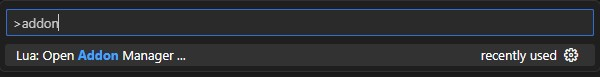
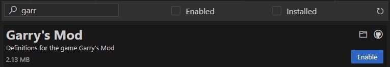

# Garry's Mod Lua API Definitions

This repository scrapes the Garry's Mod Lua API and generates snippets that will help provide autocompletion for Lua in editors like VSCode, NeoVim and more.

## 🔨 Usage

1. Install **Lua Language Server:** for your editor of choice:
    * [Visual Studio Code Extension](https://marketplace.visualstudio.com/items?itemName=sumneko.lua)
    * [NeoVim Configuration](https://github.com/LuaLS/lua-language-server#neovim)
  
2. Open the **Lua Language Server Addon Manager** with the key combination `Ctrl+Shift+P` (or `Cmd+Shift+P` on macOS) and search for *Addon*, then select **Lua: Open Addon Manager ...**:

3. Search for the **Garry's Mod** addon and **Enable** it:

4. You will now get autocompletion for the Garry's Mod Lua API in your Garry's Mod projects.

  

*Alternatively download the latest release and include or symlink it into your workspace. Get the release from [🔗 the releases page](https://github.com/luttje/glua-api-snippets/releases) it's named something like `YYYY-MM-DD_HH-MM-SS.lua.zip` .*

## 📅 **Automatically up-to-date**

Using GitHub Actions, this repository is automatically updated every first day of the month at around 00:00 UTC.

A workflow will automatically scrape the latest Garry's Mod Lua API from [the Garry's Mod Wiki](https://wiki.facepunch.com/gmod/) and package them into [🔗 a release](https://github.com/luttje/glua-api-snippets/releases).

> **Note**
>
> The Lua Language Server addon may not be 100% up-to-date with the definitions in this repository. You can help us out by updating it for everyone. There are instructions on how to do this in [the `CONTRIBUTING.md` file](https://github.com/luttje/glua-api-snippets/blob/main/CONTRIBUTING.md#updating-the-addon-for-lua-language-server).

## 🤖 Advanced Usage

### Running the Scraper Locally

You can clone this repository and run the scraper yourself. This is useful if you want to use the latest version of the API, or if you want to make changes to the scraper.

1. Clone this repository

2. Install the dependencies with `npm install`

3. Run the scraper with `npm run scrape-wiki`

### Testing the project

This project uses [Jest](https://jestjs.io/) to automate testing. You can run the tests with `npm test`.

### API as JSON

The API is also available as JSON. You can find it with the Lua API package [on the releases page](https://github.com/luttje/glua-api-snippets/releases). It is named something like `YYYY-MM-DD_HH-MM-SS.json.zip`.

## Contributors

<!-- ALL-CONTRIBUTORS-LIST:START - Do not remove or modify this section -->
<!-- prettier-ignore-start -->
<!-- markdownlint-disable -->
<table>
  <tbody>
    <tr>
      <td align="center" valign="top" width="14.28%"><a href="https://github.com/luttje"> <b>luttje</b></a> <a href="#code-luttje" title="Code">💻</a></td>
      <td align="center" valign="top" width="14.28%"><a href="https://github.com/aske02"> <b>Aske</b></a> <a href="#code-aske02" title="Code">💻</a></td>
      <td align="center" valign="top" width="14.28%"><a href="https://vurv78.github.io/"> <b>Vurv</b></a> <a href="#code-Vurv78" title="Code">💻</a></td>
      <td align="center" valign="top" width="14.28%"><a href="https://github.com/yogwoggf"> <b>jason</b></a> <a href="#ideas-yogwoggf" title="Ideas, Planning, & Feedback">🤔</a></td>
      <td align="center" valign="top" width="14.28%"><a href="https://blog.amd-nick.me"> <b>_AMD_</b></a> <a href="#bug-AMD-NICK" title="Bug reports">🐛</a></td>
      <td align="center" valign="top" width="14.28%"><a href="https://github.com/b0mbie"> <b>[aka]bomb</b></a> <a href="#bug-b0mbie" title="Bug reports">🐛</a> <a href="#code-b0mbie" title="Code">💻</a></td>
    </tr>
  </tbody>
</table>

<!-- markdownlint-restore -->
<!-- prettier-ignore-end -->

<!-- ALL-CONTRIBUTORS-LIST:END -->
